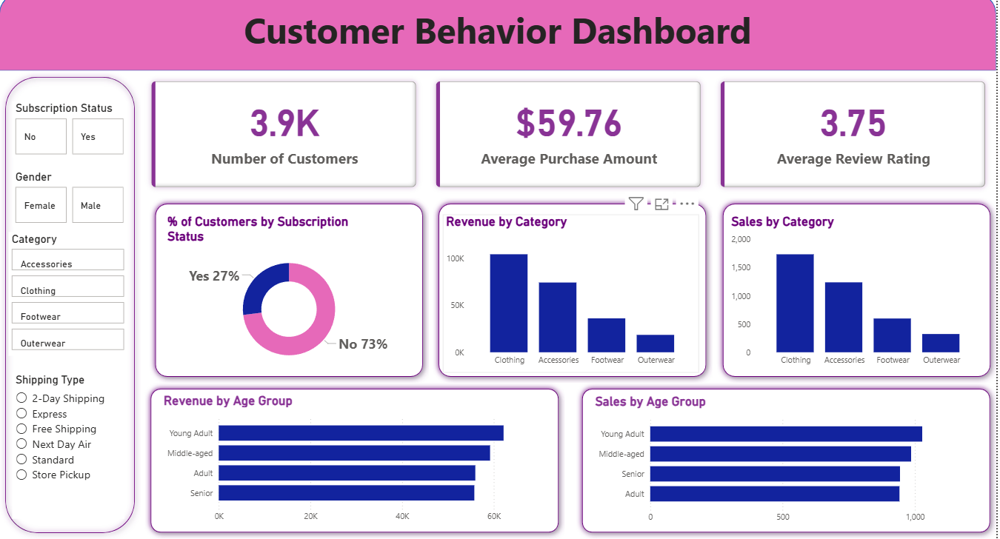

# 📊 E-commerce Sales Analysis

## 📌 Objective
Analyze e-commerce data to identify revenue trends, customer behavior, and key business insights.

---

## 🛠 Tools Used
- SQL  
- Python (Pandas, Matplotlib)  
- Power BI  
- Excel  

---

## 📂 Dataset
- 10,000+ rows of sales data  

---

## 🔍 Key Insights
- Revenue drop linked to decline in Average Order Value (AOV)  
- High discounts negatively impact profitability  
- Top products contribute majority of revenue  

---

## 📈 Business Impact
Optimizing pricing and product strategy can improve overall revenue and profit.

---

## 📷 Dashboard Preview

---

## 📁 Project Files
- SQL queries  
- Python analysis (.ipynb)  
- Dataset  
- Dashboard  

---

## 🚀 Conclusion
This project demonstrates how data analysis can drive better business decisions.
